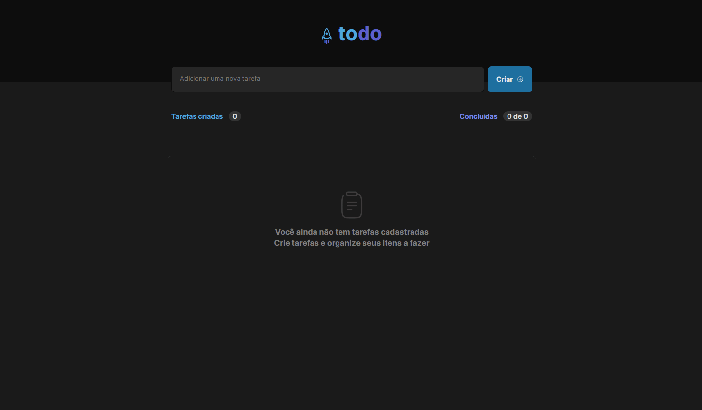
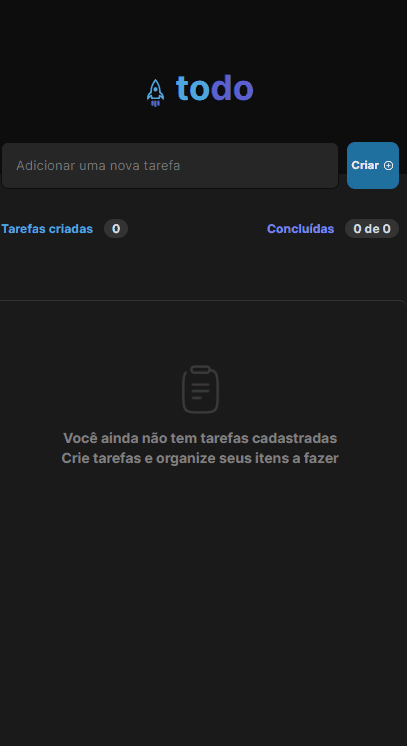
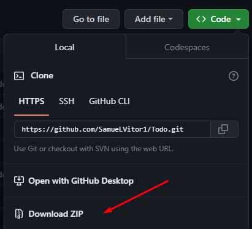

<div style="display: flex; justify-content: center; gap: 4px">
  
  # Todo 
</div>

<p style="font-size: 16px"> Todo é o primeiro desafio da trilha de ReactJS do Ignite, para realizar esse desafio usamos de vários conceitos importantes aprendidos do ReactJS durante as aulas, conceitos de estados, imutabilidade do estado, listas e chaves no ReactJS, propriedades, componentização entre outros.</p>

<h3><a href="https://todo-jwkoigha5-samuelvitor1.vercel.app/">👾Deploy</a></h3> 

<h3>📌Visão geral do projeto:</h3>



<h3>📱Responsivo :</h3>



## 🔧 Instalação
<ol>
  <p>
  Para instalar o projeto no seu computador vai precisar: 
  </p>
  <li>Baixar o projeto:</li>
   <br>

  <li>Extrai a pasta baixada do projeto e dentro dela abre o prompt </li> <br>

  <li>Agora vamos instalar as dependências do projeto, para isso podemos usar gerenciador de pacotes NPM</li>
  <p>Para instalar as dependências do projeto rodamos o seguinte comando:</p>
</ol>

  ```sh
    npm install
  ```

## 🛠️ Nesse projeto foi utilizado
<ul>
<li>ReactJS</li>
<li>Vite</li>
<li>Styled components</li>
<li>Phosphoricons</li>
</ul>
